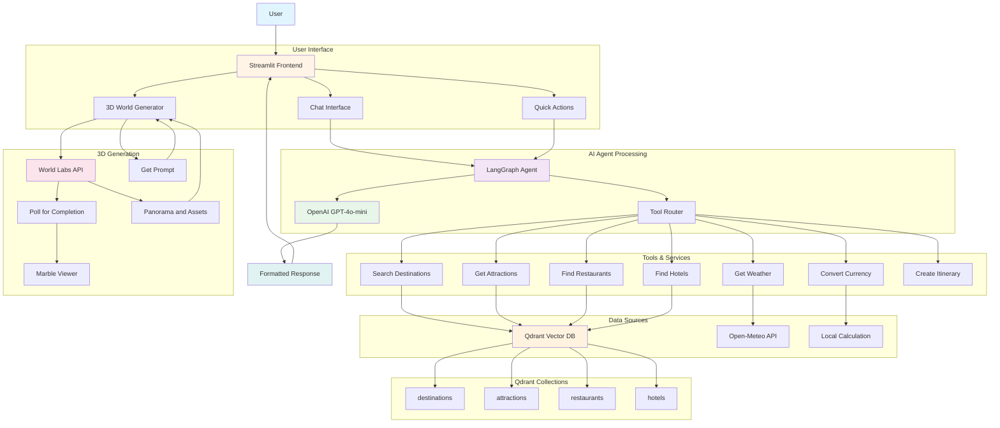
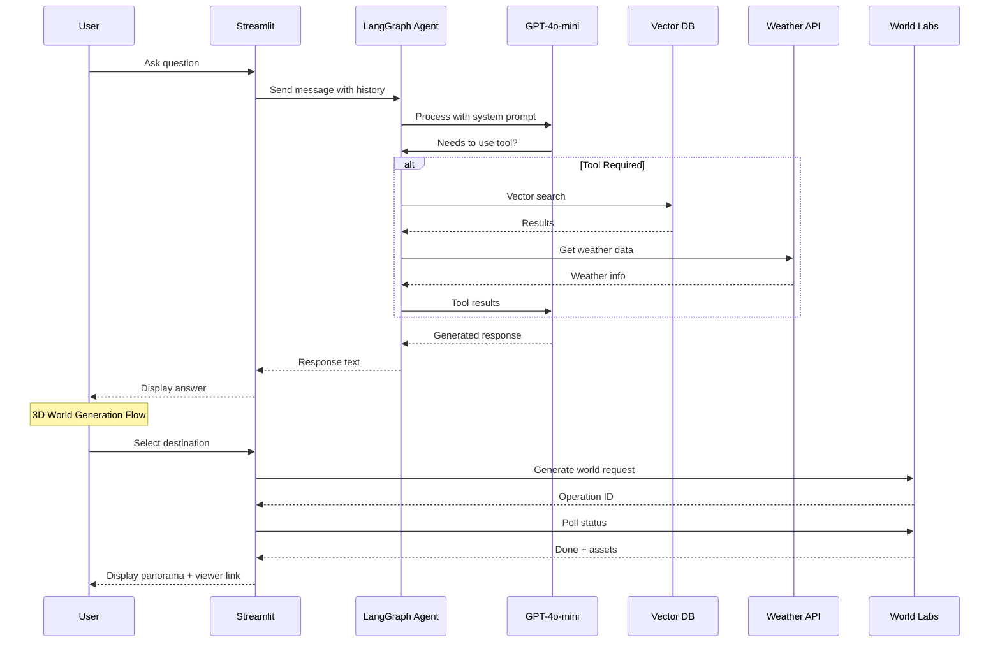
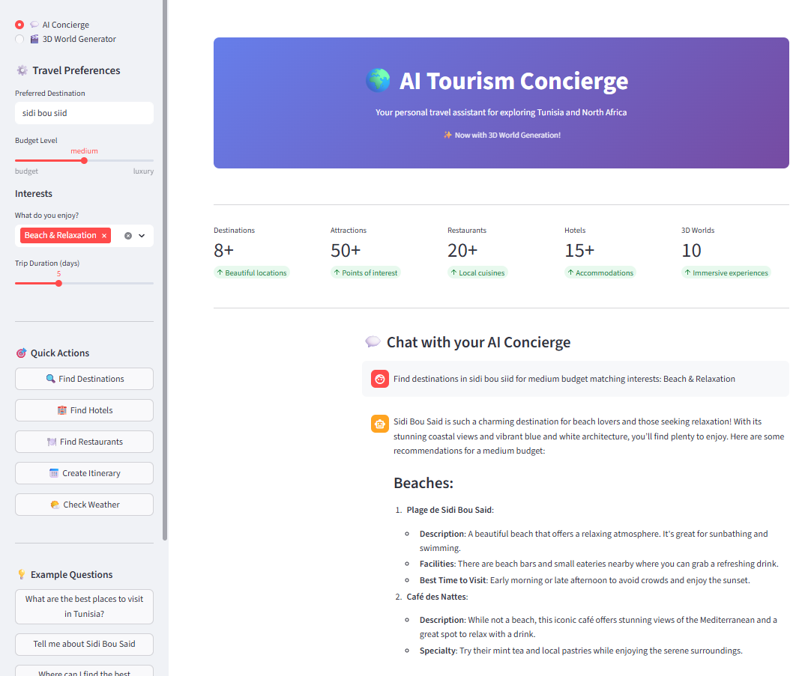
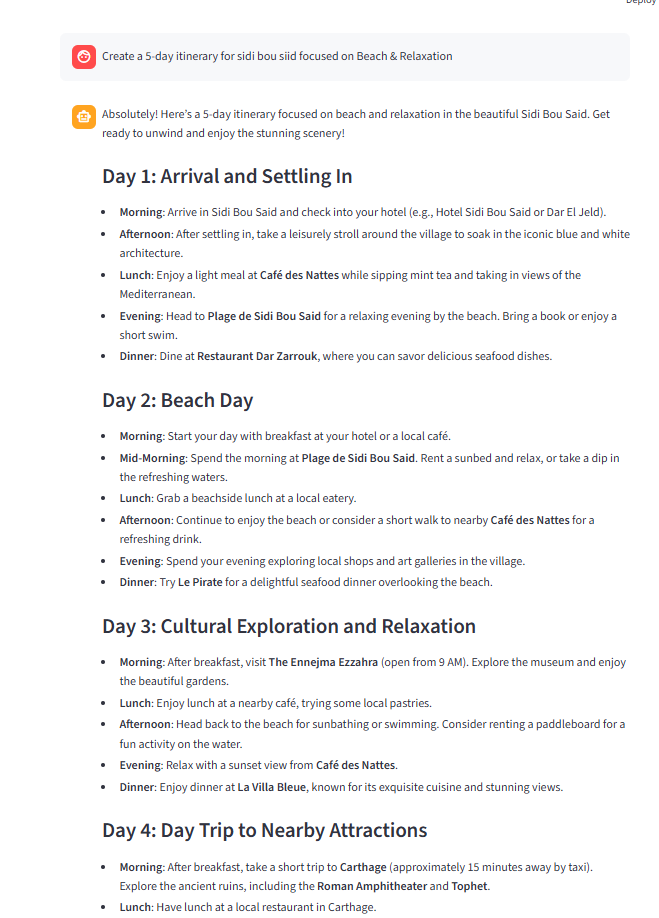
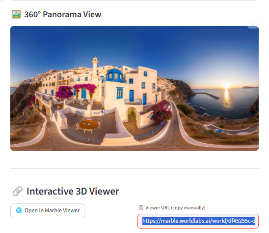
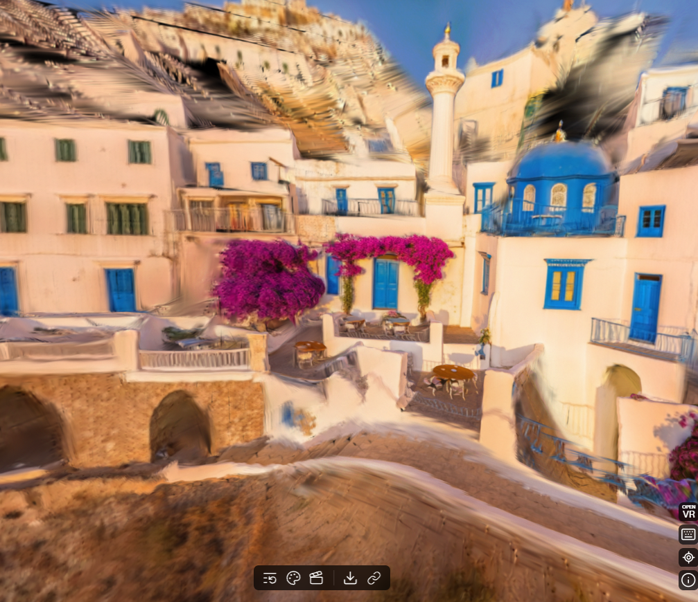
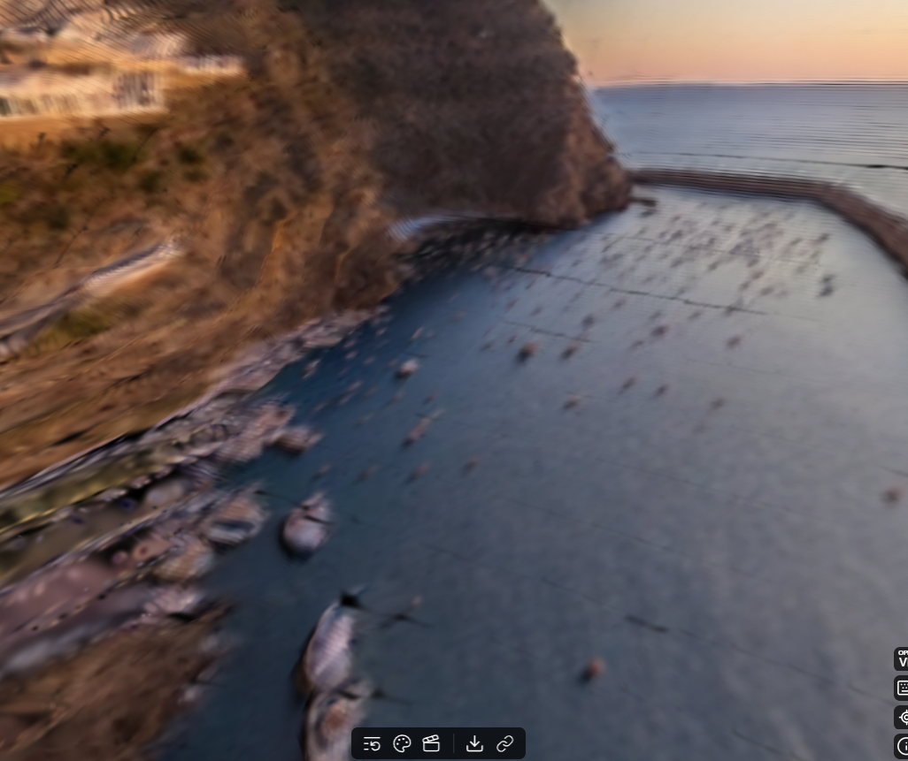
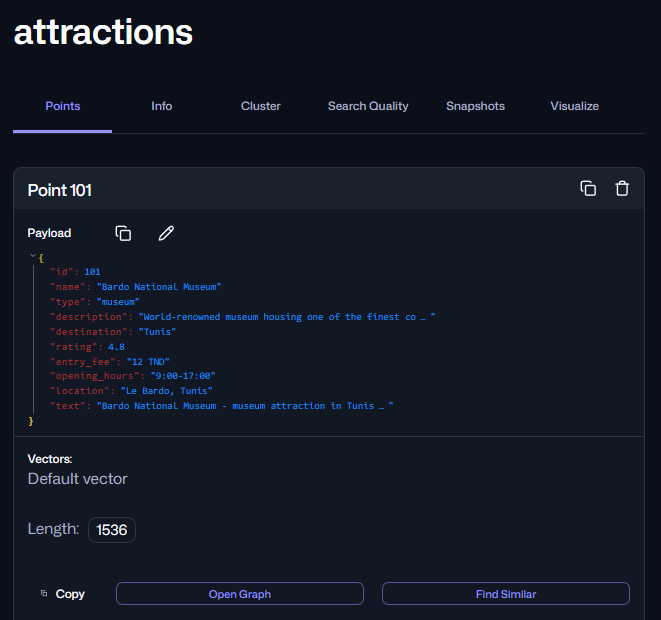
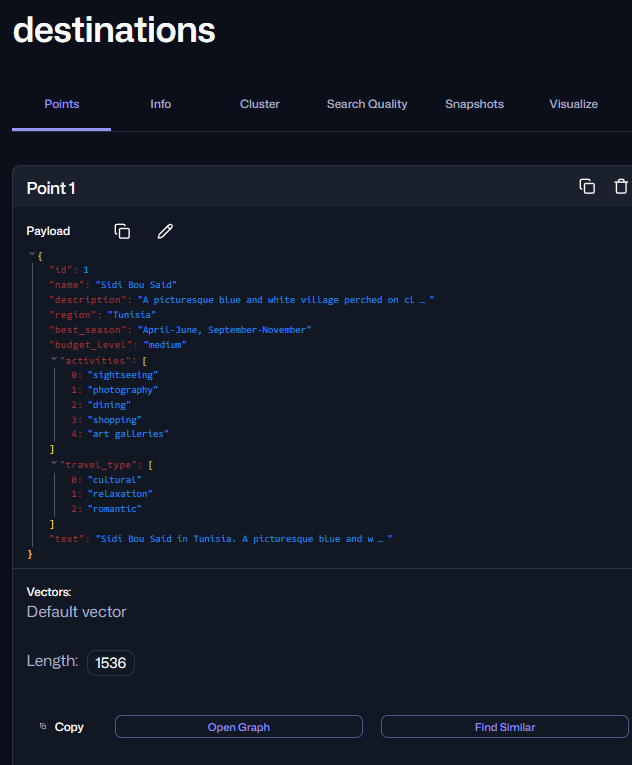
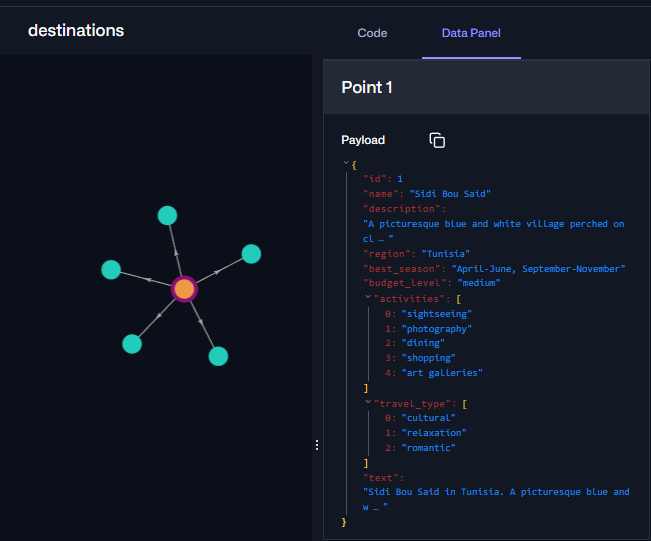

# AI Tourism Concierge - Prototype Documentation

## Project Overview

The AI Tourism Concierge is an intelligent travel assistant designed specifically for promoting tourism in Tunisia and North Africa. Built for the ARSII AI Night Challenge, this application demonstrates how artificial intelligence can transform the travel planning experience by providing personalized recommendations, destination discovery, and even immersive 3D world generation.

## Video demo : [video](2026-02-28 01-00-14.mkv)

## Challenge Context

## Technology Stack

### Backend and AI
- **LangChain**: Framework for building LLM applications
- **LangGraph**: Agent orchestration and state management
- **OpenAI GPT-4o-mini**: Language model for natural language understanding and generation
- **Google ADK**: Agent Development Kit (alternative to LangChain)
- **Python 3.10+**: Core programming language

### Database and Vector Search
- **Qdrant Vector Database**: Semantic search for destinations, attractions, restaurants, and hotels
- **OpenAI Embeddings (text-embedding-3-small)**: Text vectorization for similarity search

### 3D Content Generation (Innovation Feature)
- **World Labs Marble API**: Text-to-3D world generation
- Creates immersive, explorable 3D environments from text descriptions
- Users can virtually visit destinations before booking

### Frontend
- **Streamlit**: Web application framework for the MVP
- **Python-based**: Single-file application architecture

### Data Processing
- **Chonkie**: Text chunking framework for RAG pipelines
- **PyPDF/pdfplumber**: PDF extraction capabilities
- **Pandas**: Data manipulation and analysis

## Project Structure

```
open-challenge/
|-- .env                    # API keys (OpenAI, Qdrant, World Labs)
|-- requirements.txt        # Python dependencies
|-- app.py                 # Main Streamlit application
|-- run.py                 # Quick launch script
|-- README.md              # Project documentation
|
|-- agent/                 # AI Agent implementation
|   |-- __init__.py
|   |-- concierge.py       # Main tourism agent
|   |-- tools/             # Agent tools
|       |-- __init__.py
|       |-- destination_tools.py    # Search destinations, attractions
|       |-- travel_tools.py         # Weather, currency, itineraries
|       |-- recommendation_tools.py  # Hotels, restaurants
|
|-- database/              # Qdrant vector database setup
|   |-- __init__.py
|   |-- qdrant_setup.py    # Database manager and initialization
|
|-- utils/                 # Utility functions
|   |-- __init__.py
|   |-- config.py          # Configuration management
|   |-- embeddings.py      # OpenAI embedding functions
|
|-- prompts/               # Text prompts for World Labs
|   |-- __init__.py
|   |-- tourism_prompt.md  # Detailed destination descriptions

```

## System Architecture



## Data Flow Diagram



## UI 
Find destinations in sidi bou siid for medium budget matching interests: Beach & Relaxation




Create a 5-day itinerary for sidi bou siid focused on Beach & Relaxation





3D model of Sidi Bousid




 3D world for El Jem Roman

 


attractions collection in Qdrant


destinations collection




## Features

### 1. AI-Powered Destination Discovery
- Semantic search across Tunisian destinations
- Matches user interests with destination characteristics
- Considers budget constraints and travel preferences

### 2. Intelligent Recommendations
- **Attractions**: Historical sites, museums, natural wonders, beaches
- **Restaurants**: Local cuisine specialties, price ranges, locations
- **Hotels**: From budget to luxury, various accommodation types

### 3. Travel Planning Tools
- **Dynamic Itinerary Creation**: Day-by-day plans tailored to user interests
- **Weather Information**: Real-time weather data for any destination
- **Currency Conversion**: Quick calculations for budgeting

### 4. 3D World Generation (Innovation)
- Generate immersive 3D environments from text descriptions
- Explore destinations virtually before visiting
- Powered by World Labs Marble AI
- Supports 10+ Tunisian destinations

### 5. Conversational Interface
- Natural language interaction
- Context-aware conversations
- Quick action buttons for common requests

## Tunisia Tourism Data Included

### Destinations (8 locations)
1. **Sidi Bou Said** - Blue and white village with Mediterranean views
2. **Carthage** - Ancient Roman ruins and archaeological sites
3. **El Jem** - Roman colosseum, UNESCO World Heritage site
4. **Sahara Desert (Douz)** - Camel treks, Star Wars filming locations
5. **Djerba** - Island paradise with beaches and Jewish heritage
6. **Kairouan** - Holy city with Great Mosque
7. **Hammamet** - Beach resort with jasmine flowers
8. **Matmata** - Underground troglodyte homes, Star Wars location

### Attractions (10+ sites)
- Bardo National Museum (Roman mosaics)
- Antonine Baths (Carthage)
- Medina of Tunis (UNESCO site)
- Ribat of Sousse
- Lake Ichkeul National Park
- And more...

### Restaurants and Hotels (15+ each)
- Budget to luxury options
- All regions of Tunisia covered
- Local cuisine highlights

## Installation and Setup

### Prerequisites
- Python 3.10 or higher
- pip or uv package manager
- API keys for OpenAI, Qdrant, and World Labs

### Setup Steps

1. **Clone or download the project**

2. **Create virtual environment**
   ```bash
   uv venv
   .venv/scripts/activate
   ```

3. **Install dependencies**
   ```bash
   uv pip install -r requirements.txt
   ```

4. **Configure environment variables**
   The `.env` file should contain:
   ```
   OPENAI_API_KEY=your_openai_api_key
   QDRANT_API_KEY=your_qdrant_api_key
   QDRANT_URL=https://your-qdrant-url
   WORLD_LABS=your_world_labs_api_key
   ```

5. **Initialize the database**
   ```bash
   python scripts/init_database.py
   ```

6. **Run the application**
   ```bash
   streamlit run app.py
   ```

## Usage Guide

### Main Interface Navigation

#### AI Concierge Tab
This is the main chat interface where users can:
- Ask questions about Tunisian destinations
- Request restaurant and hotel recommendations
- Get weather information
- Create custom travel itineraries
- Convert currency for budgeting

#### 3D World Generator Tab
This innovative feature allows users to:
1. Select a Tunisian destination from a dropdown
2. Choose generation quality (Mini for speed, Plus for quality)
3. Generate a 3D world in 30 seconds to 5 minutes
4. View the generated world with:
   - Panorama images
   - AI-generated scene descriptions
   - Links to interactive Marble Viewer

### Quick Actions (Sidebar)
- **Find Destinations**: Search based on preferences
- **Find Hotels**: Accommodation recommendations
- **Find Restaurants**: Dining suggestions
- **Create Itinerary**: Day-by-day planning
- **Check Weather**: Current conditions and forecast

### Example Questions
- "What are the best places to visit in Tunisia?"
- "Tell me about Sidi Bou Said"
- "Where can I find the best Tunisian food?"
- "What's the weather like in Hammamet?"
- "Convert 100 USD to TND"
- "Create a 5-day cultural itinerary"

## How It Works

### Architecture Overview

1. **User Input** → Streamlit frontend
2. **Intent Understanding** → LangGraph Agent
3. **Tool Selection** → Based on user request type
4. **Data Retrieval** → Qdrant vector database
5. **Response Generation** → GPT-4o-mini
6. **Display** → Formatted in Streamlit UI

### Agent Tools

The agent has access to several tools:
- `search_destinations`: Vector search in destinations collection
- `get_attractions`: Find attractions by location and type
- `get_weather`: Fetch real-time weather data
- `convert_currency`: Calculate exchange rates
- `recommend_restaurants`: Find dining options
- `recommend_hotels`: Find accommodation options
- `create_itinerary`: Generate day-by-day plans

### Vector Database Schema

**Collections:**
- `destinations`: Name, description, region, activities, budget level
- `attractions`: Name, type, rating, opening hours, entry fee
- `restaurants`: Name, cuisine, price range, specialties
- ` hotels`: Name, type, amenities, price range

All text is embedded using OpenAI's text-embedding-3-small model (1536 dimensions).

## Innovation and Competitive Advantage

### 1. 3D World Generation
This is the standout feature for the challenge. Unlike traditional tourism apps that only show static images, our application can:
- Generate photorealistic 3D environments from text
- Allow virtual exploration of destinations
- Create immersive experiences that inspire travel

### 2. Intelligent Agent
Instead of static FAQ pages, the AI agent:
- Understands context and user preferences
- Provides personalized recommendations
- Handles complex, multi-step queries

### 3. Semantic Search
Traditional keyword search is replaced with semantic understanding:
- "beach destinations" finds coastal towns
- "historical sites" finds ruins and museums
- "family-friendly" finds appropriate attractions

## Future Enhancements

### Planned Features
1. **Multi-language Support**: Arabic and French for Tunisian tourists
2. **Booking Integration**: Direct hotel and restaurant reservations
3. **User Reviews**: Community-driven ratings and feedback
4. **Virtual Tours**: Guided video content for each destination
5. **Offline Mode**: Downloadable content for travelers without internet

### Scalability
The architecture supports easy expansion to:
- Additional countries in North Africa
- More destinations within Tunisia
- Integration with local tourism boards
- Partnership with hotels and tour operators

## Challenges and Solutions

### Challenge 1: API Rate Limits
- **Solution**: Implemented caching for Qdrant search results
- **Solution**: Used Mini model for faster/cheaper generations

### Challenge 2: Context Retention
- **Solution**: Limited conversation history to last 5 messages
- **Solution**: Structured state management in LangGraph

### Challenge 3: 3D Generation Time
- **Solution**: Offer Mini (30-45s) and Plus (5min) model options
- **Solution**: Async polling with progress updates
